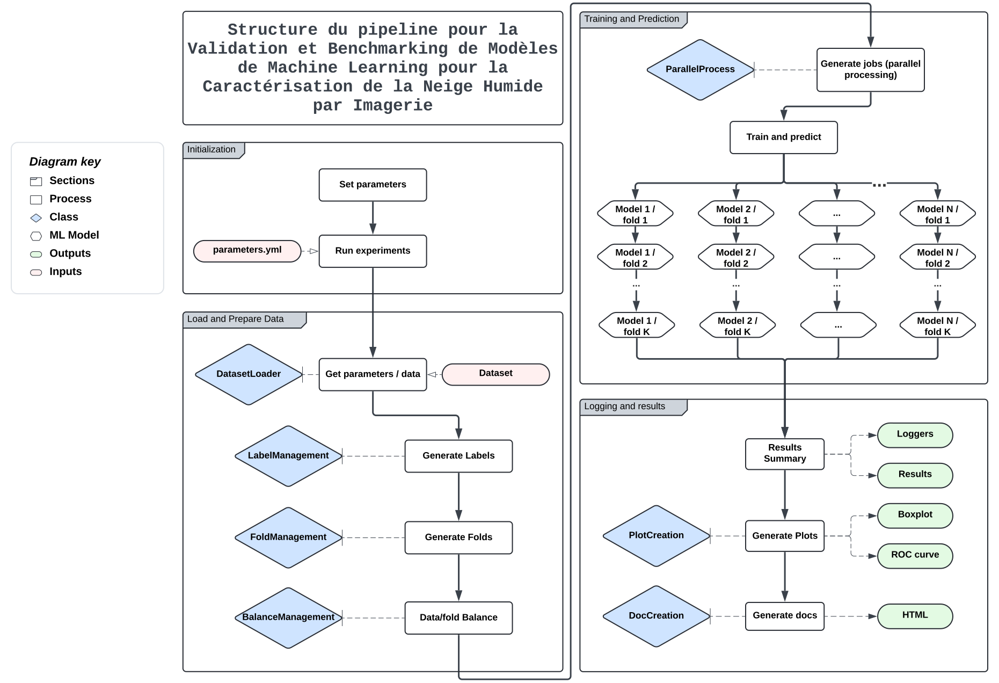

## Projet de création d'un pipeline

Projet basé sur le projet : [ML-WetSnowSAR](https://github.com/Matthieu-Gallet/ML-WetSnowSAR)      
Projet de thésard Matthieu Gallet.

Notion du projet : [Stage LISTIC 2024](https://www.notion.so/Stage-LISTIC-2024-58c77ade8f224b1688b7884a6151fe54?pvs=4)

## How to Deploy an Experiment with Qanat

1. Install Qanat:
Follow the installation instructions: Qanat installation: [Qanat installation](https://ammarmian.github.io/qanat/installation.html)     

2. Open the terminal in the **pipeline folder** and initialize Qanat by running:
```
qanat init .
```


3. Initial
ize the Results Folder:
You will see the following prompt:

``` 
[14:21:20] INFO     Initializing Qanat repertory.                     init.py:27
Where do you want to store the results? (./results): ./results 
```

4. Create a New Experiment:    

* Create with Bash:    
Once Qanat is initialized in the pipeline folder, create a new experiment:
```
qanat experiment new
```
Use the following information. The important values to use are the same path and executable. Feel free to choose the rest of the variables:
```
Name: pipeline
Description: pipeline
Path: evaluation
Executable: evaluation/learning_models.py
Execute command of the experiment (/usr/bin/bash): python
Tags: ['ML', 'benchmarking']
Datasets: []
Do you want to add this experiment? [y/n]: y 
```         
* Create from YAML:
Using the following bash command, an experiment will be created directly with the correct paths:

```
qanat experiment new -f ./parameter/qanat_experiment.yml
```
5. Run the Experiment:
Once the experiment is created, set your parameter_file.yml with all the values and deploy the experiment:         
* For testing the groups:
```
qanat experiment run <experiment_name> --param_file "./parameter/config_param.yml" --dry_run
```
* For running the experiment:
```
qanat experiment run <experiment_name> --param_file "./parameter/config_param.yml"
``` 

## Pipeline Structure


